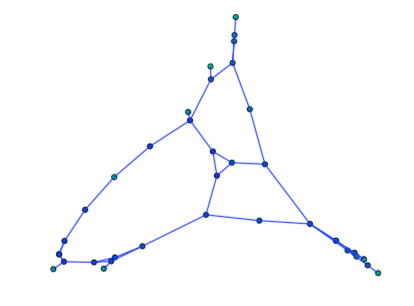
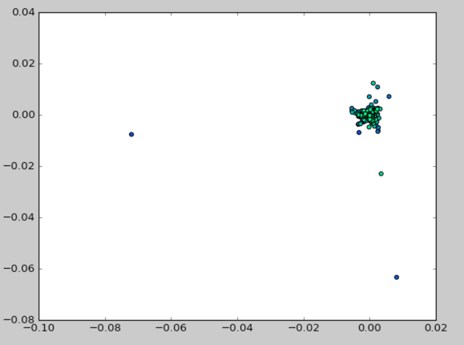

GraphPCA
========

Produces a low-dimensional representation of the input graph.

Calculates the ECTD [1]_ of the graph and reduces its dimension using PCA. The
result is an embedding of the graph nodes as vectors in a low-dimensional
space.

Graph data in this repository is courtesy of
`University of Florida Sparse Matrix Collection <https://www.cise.ufl.edu/research/sparse/matrices/>`_.

Python 3.x and 2.6+.

See the API docs: https://brandones.github.io/graphpca/

Usage
-----

Draw a graph, including edges, from a mat file
::

    >>> import scipy.io
    >>> import networkx as nx
    >>> import graphpca
    >>> mat = scipy.io.loadmat('test/bcspwr01.mat')
    >>> A = mat['Problem'][0][0][1].todense()  # that's just how the file came
    >>> G = nx.from_numpy_array(A)
    >>> graphpca.draw_graph(G)

Get a 2D PCA of a high-dimensional graph and plot it.
::

    >>> import networkx as nx
    >>> import graphpca
    >>> g = nx.erdos_renyi_graph(1000, 0.2)
    >>> g_2 = graphpca.reduce_graph(g, 2)
    >>> graphca.plot_2d(g_2)

Contributing
------------

Issues and Pull requests are very welcome! [On GitHub](https://github.com/brandones/graphpca).

.. [1] https://www.info.ucl.ac.be/~pdupont/pdupont/pdf/ecml04.pdf

